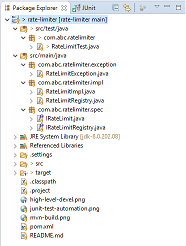

# Rate Limiter

## Introduction 
*Rate Limiter* is a tool that monitors the number of requests agreed per seconds . If the request count exceeds the number agreed by the service owner and the user (in a decided window time), the rate limiter blocks all the excess calls (say by throwing exceptions). The user can be a human or any other service (ex: in a micro service-based architecture)

## Objectives

- Different APIs would have different rate limits (if limit is not provided, system takes default as 100 requests per sec)
- Should be possible to set default limits. This will be applied when an API specific limit has not been configured.
- The solution should consider rate limiting based on User+API combination
- The solution should be plug and play (easily configurable)
- Production ready code (Automated tests are mandatory)

## Design

### High Level Design
 <!-- .element height="100%" width="100%" -->

### Project & Package Structure
 <!-- .element height="100%" width="100%" -->

## How to Build & Test ?

- Project uses maven for packaging and it can be built by running below command in project root area on windows command prompt or from Eclipse run configuration
```sh
mvn clean install
```
- After above build, output jar will *rate-limit-1.0.jar* will be available in target folder. This jar can be plugged in to any services.

 <!-- .element height="100%" width="100%" -->

- By running above maven build command, JUnit tests will be executed. Same JUnit tests can also be executed from Eclipse. 

 <!-- .element height="100%" width="100%" -->

## Production Ready Code

Below aspects have been taken in consideration in order to make project Production ready 

- **Maven Build** - As shared above, *Rate Limiter* project uses maven for packaging
- **JUnit Test** - Poject has automated JUnit tests
- **Logging** - For better understanding of what system is doing, code also has logging in place (no system.out.println)
- **Custom Exception Handling** - In case user exceeds rate-limit, library will throw custom RateLimitException which provides details like UserID, APIid & default-max-limit

## How to Plug-it ?
Below code sample & comments provide idea about how *rate-limit-1.0.jar* can be used in other projects
```sh
// Register rate-limit for an APIid
RateLimitRegistry._instance.registerRateLimitForAPI(apiID, new RateLimitImpl(apiID)); 
// Get handle of rateLimit onject from registery
IRateLimit rateLimit = RateLimitRegistry._instance.getRateLimit(apiID);
// Default rate-limit for API is 100. Override default-max-rate-limit for API (if required)
rateLimit.setDefaultLimit(200);
// Call checkIfUserExceededRateLimit method for every request
// RateLimitException will be thrown in case user exceeds max-rate-limit for API
rateLimit.checkIfUserExceededRateLimit(userID);
```

